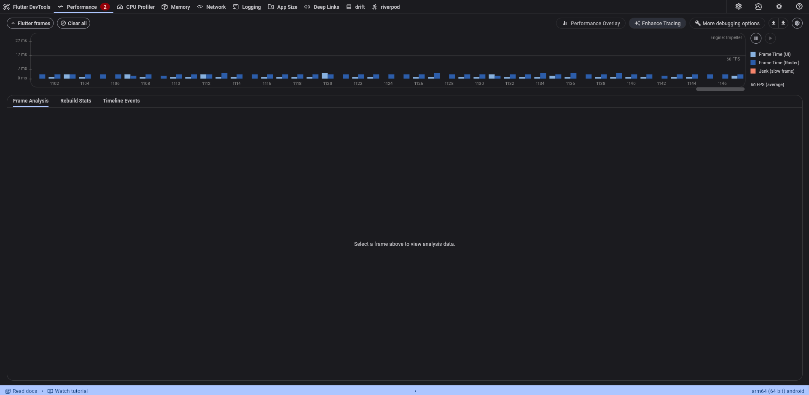
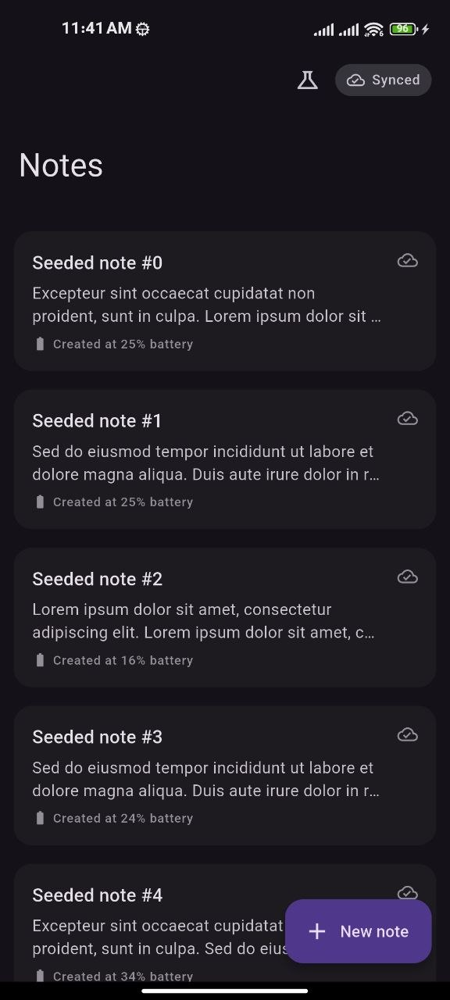
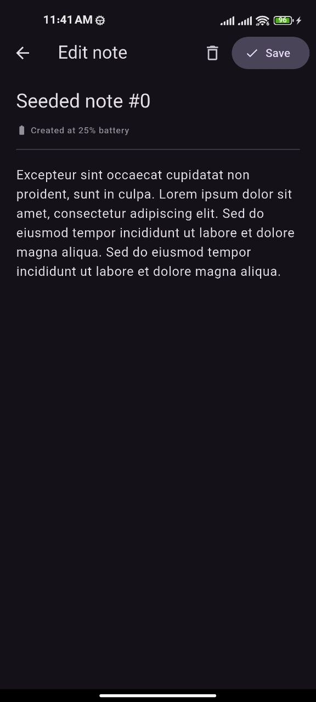
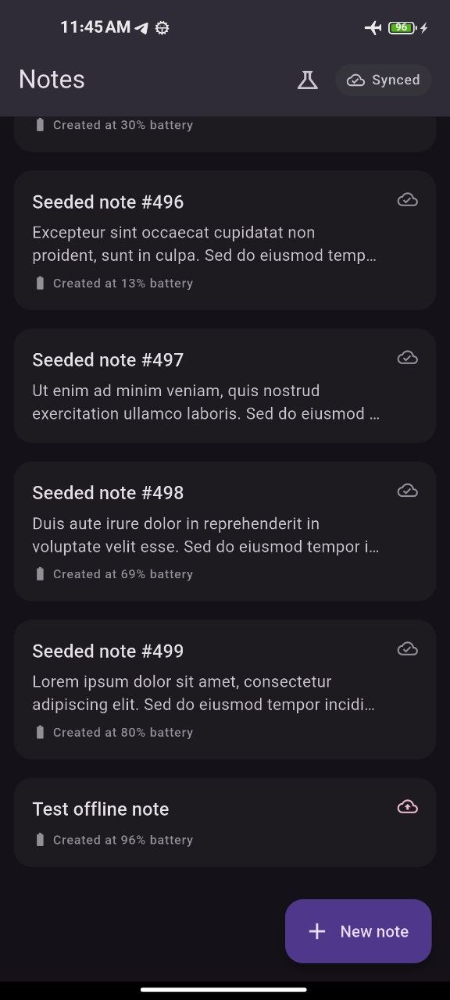
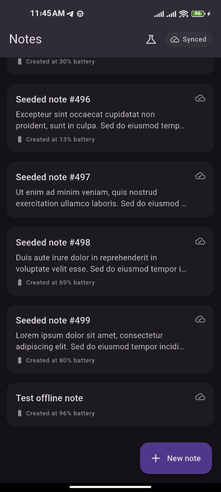

# Offline-First Notes with Cloud Sync

A Flutter notes app that works fully offline and syncs automatically to Firebase Firestore when reconnected — built with Drift, a documented last-write-wins conflict-resolution flow (including soft-deletes), and a hand-written native Android platform bridge for reading battery level.

## Features

- Full offline CRUD for notes (create, edit, delete), persisted locally with [Drift](https://drift.simonbinder.eu/) (SQLite).
- Each note tracks a sync status (`pending` / `synced`), shown in the UI.
- On reconnect, pending notes are pushed to Firestore and remote changes are pulled down automatically — no polling, no manual refresh required.
- Conflict resolution: last-write-wins by `updatedAt`, including deletes (see [Sync & Conflict Resolution](#sync--conflict-resolution) below).
- Each note quietly records the phone's battery percentage at creation time, read through a hand-written `MethodChannel` to Kotlin (not a package).
- Material 3 UI, light/dark by system setting.

## Scope

- **Android only.** The native battery bridge is Android/Kotlin-specific by design, and there is no Mac/Xcode available in this project's development environment to build or test iOS. The architecture stays platform-agnostic where it costs nothing to (`BatteryChannel` returns `null` gracefully on any platform without an implementation), but no iOS-specific code exists.
- No accounts/auth — a single fixed Firestore collection, no per-user separation.
- No rich text, attachments, tags, or search — plain title + body only.
- No manual conflict-resolution UI — last-write-wins only, by design.

## Architecture

Clean-architecture-style layering:

```
domain/
  entities/     Note (id, title, body, batteryAtCreation, createdAt, updatedAt, syncStatus, isDeleted)
  usecases/     AddNote, UpdateNote, DeleteNote, WatchNotes, SyncNotes
  repositories/ NotesRepository (abstract contract)
  core/         Failure, Result<T>

data/
  local/        AppDatabase (Drift), NotesDao, NotesLocalDataSource
  remote/       NotesRemoteDataSource (Firestore), BatteryChannel (MethodChannel wrapper)
  sync/         SyncService — connectivity listener, push/pull, conflict resolution
  repositories/ NotesRepositoryImpl (composes local storage + SyncService)

presentation/
  riverpod/     NotesNotifier, SyncStatusNotifier, and the app's dependency graph
  screens/      NotesListScreen, NoteEditScreen
  router/       app_router.dart (go_router)

android/app/src/main/kotlin/.../MainActivity.kt   hand-written native battery bridge
```

The presentation layer never talks to Firestore or connectivity state directly — everything goes through `NotesRepository`, which reads from local storage instantly and delegates anything network-related to `SyncService`.

## Tech stack

| Package | Why |
|---|---|
| `drift` + `sqlite3` | Local-first storage; Flutter Favorite, reactive streams map directly onto Riverpod. `sqlite3` (not `sqlite3_flutter_libs`, which is deprecated) provides the native SQLite bindings. |
| `flutter_riverpod` | State management and dependency injection. |
| `go_router` | Declarative routing (`/notes`, `/notes/new`, `/notes/:id/edit`). |
| `firebase_core` + `cloud_firestore` | Cloud backend, chosen to avoid writing/hosting a custom server while still exercising real cloud sync semantics. |
| `connectivity_plus` | Triggers a sync pass on reconnect. |
| `uuid` | Client-generated note IDs, reused as both the Drift primary key and the Firestore document ID. |

## Getting started

### Prerequisites

- Flutter `>=3.44.2`, Dart SDK `^3.12.0`.
- Android Studio (for the Android SDK/emulator and, notably, its bundled JDK — see below).
- Node.js + npm (for the Firebase CLI).

### 1. Install dependencies

```bash
flutter pub get
```

### 2. Firebase project setup

This project uses `flutterfire_cli` to generate its own Firebase configuration — this step is per-developer and isn't committed to the repo:

```bash
npm install -g firebase-tools
firebase login
dart pub global activate flutterfire_cli
flutterfire configure
```

Select or create a Firebase project, and choose Android only when prompted. This generates `lib/firebase_options.dart` and `android/app/google-services.json`, neither of which are committed.

### 3. Firestore: local emulator instead of production

Cloud Firestore now requires a billing account to be linked to the project before a database can even be created — even to stay within the permanently-free quota. A billing account wasn't available for this project, so the app talks to the Firestore Local Emulator Suite instead of a live Firestore database. This is a real Firestore implementation (Google's own reference server), not a mock — same client SDK, same query semantics, just running on localhost instead of Google's servers.

One-time setup:

```bash
firebase init emulators
```

Select only the Firestore emulator. Then edit the generated `firebase.json` so the emulator listens on every network interface (required so a physical phone on the same Wi-Fi can reach it, not just the emulator host machine):

```json
{
  "emulators": {
    "firestore": {
      "host": "0.0.0.0",
      "port": 8080
    }
  }
}
```

Allow the port through the Windows firewall (run as Administrator):

```powershell
New-NetFirewallRule -DisplayName "Firestore Emulator" -Direction Inbound -LocalPort 8080 -Protocol TCP -Action Allow
```

The Firestore emulator requires Java 21+. If your system Java is older (Android/Gradle itself may deliberately target an older version — this project's Android build targets Java 17), don't change your global `JAVA_HOME`. Android Studio ships its own JDK 21 you can point at for just this terminal session instead:

```powershell
$env:JAVA_HOME = "C:\Program Files\Android\Android Studio\jbr"
$env:PATH = "$env:JAVA_HOME\bin;$env:PATH"
java -version   # should print 21.x
```

Every time you develop:

```bash
firebase emulators:start --only firestore
```

Leave this running. View its contents at `http://127.0.0.1:4000/firestore`. Data is not persisted between runs unless you add `--export-on-exit=./emulator-data --import=./emulator-data`.

In `lib/main.dart`, the app points at the emulator via:

```dart
const useFirestoreEmulator = true;
const firestoreEmulatorHost = '192.168.x.x'; // this machine's LAN IP
const firestoreEmulatorPort = 8080;
```

Update `firestoreEmulatorHost` to your machine's actual Wi-Fi IP address (`ipconfig` / `Get-NetIPAddress`) — the phone and computer must be on the same network. If a VPN is active on the development machine, it can sometimes reroute local network traffic and prevent the phone from reaching the emulator; disable it if the app can't connect.

Flip `useFirestoreEmulator` to `false` once a Firestore project with billing (and a real database) is available — no other code changes are needed.

### 4. Native battery bridge

The Kotlin side isn't generated by tooling and must be added by hand to `android/app/src/main/kotlin/com/example/offline_notes_sync/MainActivity.kt`:

```kotlin
package com.example.offline_notes_sync

import android.content.Context
import android.os.BatteryManager
import io.flutter.embedding.android.FlutterActivity
import io.flutter.embedding.engine.FlutterEngine
import io.flutter.plugin.common.MethodChannel

class MainActivity : FlutterActivity() {
    private val batteryChannelName = "com.example.offline_notes_sync/battery"

    override fun configureFlutterEngine(flutterEngine: FlutterEngine) {
        super.configureFlutterEngine(flutterEngine)

        MethodChannel(flutterEngine.dartExecutor.binaryMessenger, batteryChannelName)
            .setMethodCallHandler { call, result ->
                if (call.method == "getBatteryLevel") {
                    val batteryManager =
                        getSystemService(Context.BATTERY_SERVICE) as BatteryManager
                    val level = batteryManager.getIntProperty(BatteryManager.BATTERY_PROPERTY_CAPACITY)
                    result.success(level)
                } else {
                    result.notImplemented()
                }
            }
    }
}
```

### 5. Run

```bash
flutter run
```

## Sync & Conflict Resolution

`SyncService` listens to `Connectivity().onConnectivityChanged`. On a transition from disconnected to connected, it runs one sync pass:

1. **Push** — every locally `pending` note is written to its Firestore document (`notes/{id}`, where `id` is the note's client-generated UUID) and marked `synced` locally.
2. **Pull** — Firestore documents with `updatedAt` newer than the last successful sync are fetched.
3. **Resolve** — for any note that was both pushed in step 1 and pulled back in step 2 with a different value, the two `updatedAt` timestamps (UTC epoch-millis) are compared: the strictly newer side wins; an exact tie favors the remote copy, since a tie means another device already resolved and wrote that exact state.

### Soft deletes (tombstones)

Deleting a note does not remove its row locally, and does not delete its Firestore document. Instead, the note is updated in place with `isDeleted = true` and a fresh `updatedAt` — a tombstone. This deliberately reuses the exact same push/pull/conflict-resolution path as a normal edit:

- A pending tombstone gets pushed like any other pending note.
- A tombstone pulled from Firestore with a newer `updatedAt` than the local copy soft-deletes the local row, using the same last-write-wins comparison as any other field change.
- `NotesDao.watchAllNotes()` filters out `isDeleted = true` rows, so tombstones are invisible in the UI without needing any special-casing in the sync engine itself.

This avoids a real bug the naive hard-delete approach has: without a tombstone, a note deleted while offline would have no record locally that a deletion happened, and a later full pull (e.g. after an app restart) would silently resurrect it from Firestore.

## Known Limitations

These are deliberate, documented simplifications for this project's scope — not oversights:

- **Tombstones are never pruned.** Deleted notes' records persist indefinitely, both locally and in Firestore. A real product would garbage-collect tombstones after some retention window (e.g. 30 days); that cleanup job is out of scope here.
- **The last-synced timestamp is kept in memory only**, not persisted across app restarts. A fresh app launch re-pulls every remote note once (safe — upserts are idempotent — just not maximally bandwidth-efficient) rather than only the ones that changed since the last session.
- **Android only** — see [Scope](#scope).
- **Runs against the Firestore emulator**, not a production Firestore database, for the reason explained above. The conflict-resolution logic itself is identical either way; only the endpoint changes.
- **The app ID** (`com.example.offline_notes_sync`) is a placeholder and must be changed before any real publishing.

## Testing

```bash
flutter test                                            # unit + widget tests
flutter test integration_test/add_note_sync_test.dart   # integration test (needs a connected device/emulator)
```

Coverage:

- **Unit** — all five usecases (mocked `NotesRepository`), `NotesDao` (in-memory Drift, no file I/O), and — most importantly — `SyncService`'s conflict resolution: regular last-write-wins in both directions, a tie favoring remote, both tombstone directions (a newer local delete gets pushed; a newer remote delete gets applied locally), and the error path when a push fails.
- **Widget** — `NotesListScreen`'s empty, populated, and syncing states, with Firebase/Drift fully bypassed via a fake `NotesRepository`.
- **Integration** — adding a note while offline (mocked disconnected `Connectivity`), confirming it stays `pending`, then simulating reconnect and confirming the real `SyncService` picks it up and marks it `synced`. Firestore and connectivity are mocked; the database, repository, and sync engine are all real.
- The native `BatteryChannel` is designed to be tested via `TestDefaultBinaryMessengerBinding`/`setMockMethodCallHandler` (mocking at the Dart boundary, never invoking real platform code) — **not yet added**.

## Performance

Profiled with Flutter DevTools after seeding 500 synthetic notes into local storage via a debug-only seeding button, then scrolling through the full list while recording.

| Metric | Result |
|---|---|
| Total frames captured | 771 |
| Frames exceeding the 16.67ms (60fps) budget | 2 (0.3%) |
| Jank during active scrolling (post cold-start) | 0 frames |
| Avg build time | ~1.7ms |
| Avg raster time | ~3.2ms |

Both of the two frames that exceeded budget occurred in the first 70ms of the capture (engine/first-frame cold-start cost), not during scrolling. Across the remaining 694 recorded frames — all captured while actively scrolling the 500-note list — there was zero jank.

No optimization pass was needed based on this data: `ListView.builder` and `const` constructors were already in place from when the screen was first written, and the list holds up cleanly under 500 items without visible frame drops.

One theoretical inefficiency was flagged during development but not confirmed as a real problem: `SyncStatusNotifier` is watched near the top of `NotesListScreen`, so in principle a sync-status change could trigger a full-screen rebuild rather than just the status badge. In practice this produced no measurable jank (sync-status changes are infrequent — once per reconnect, not once per frame), so it was left as-is rather than adding a `Consumer` to scope it, to avoid over-engineering something the data doesn't show as an actual performance problem.



## Screenshots

| Notes List | Edit Note |
|---|---|
|  |  |

**Offline → Synced.** The same note, created with no connectivity (airplane mode, pending-upload icon) and then again moments after reconnecting (synced icon) — no manual refresh, `SyncService` picks it up automatically on the connectivity change:

| Offline (pending) | Reconnected (synced) |
|---|---|
|  |  |

## License

MIT